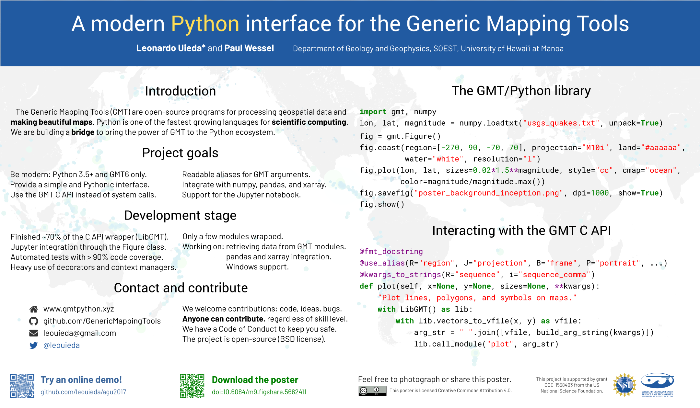

# A modern Python interface for the Generic Mapping Tools

[Leonardo Uieda](http://leouieda.com/)
and
[Paul Wessel](http://www.soest.hawaii.edu/wessel/)

**ONLINE DEMO:** Click on the badge launch a Jupyter notebook on [mybinder.org](https://mybinder.org) 

Poster presentation at the AGU Fall Meeting 2017.

**Abstract:** [IN51B-0018](https://agu.confex.com/agu/fm17/meetingapp.cgi/Paper/233450)

**Session:** [Challenges and Benefits of Open Source Software and Open Data](https://agu.confex.com/agu/fm17/meetingapp.cgi/Session/23607)

**When:** Friday, 15 December 2017 | 08:00 - 12:20

**Where:** Poster Hall D-F

**Download the poster in PDF:** doi:[10.6084/m9.figshare.5662411](https://doi.org/10.6084/m9.figshare.5662411)

## Abstract

Figures generated by The Generic Mapping Tools (GMT) are present in countless
publications across the Earth sciences. The command-line interface of GMT lends
the tool its flexibility but also creates a barrier to entry for beginners.
Meanwhile, adoption of the Python programming language has grown across the
scientific community. This growth is largely due to the simplicity and low
barrier to entry of the language and its ecosystem of tools. Thus, it is not
surprising that there have been at least three attempts to create Python
interfaces for GMT: [gmtpy](https://github.com/emolch/gmtpy),
[pygmt](https://github.com/ian-r-rose/pygmt), and
[PyGMT](https://github.com/glimmer-cism/PyGMT). None of these projects are
currently active and, with the exception of pygmt, they do not use the GMT
Application Programming Interface (API) introduced in GMT 5.  The two main
Python libraries for plotting data on maps are the matplotlib Basemap toolkit
(matplotlib.org/basemap) and Cartopy (scitools.org.uk/cartopy), both of which
rely on matplotlib (matplotlib.org) as the backend for generating the figures.
Basemap is known to have limitations and is being discontinued.  Cartopy is an
improvement over Basemap but is still bound by the speed and memory constraints
of matplotlib. We present a new Python interface for GMT (GMT/Python) that
makes use of the GMT API and of new features being developed for the upcoming
GMT 6 release. The GMT/Python library is designed according to the norms and
styles of the Python community. The library integrates with the scientific
Python ecosystem by using the “virtual files” from the GMT API to implement
input and output of Python data types (numpy “ndarray” for tabular data and
xarray “Dataset” for grids). Other features include an object-oriented
interface for creating figures, the ability to display figures in the Jupyter
notebook, and descriptive aliases for GMT arguments (e.g., “region” instead of
“R” and “projection” instead of “J”). GMT/Python can also serve as a backend
for developing new high-level interfaces, which can help make GMT more
accessible to beginners and more intuitive for Python users. GMT/Python is an
open-source project hosted on Github
([GenericMappingTools/gmt-python](https://github.com/GenericMappingTools/gmt-python))
and is in early stages of development. A first release will accompany the
release of  GMT 6, which is expected for early 2018.

## Notes

I used the fonts Roboto Mono for code, Roboto for headings, and Barlow for text.
All can be downloaded from [Google Fonts](https://fonts.google.com/).

The poster was made using [Inkscape](https://inkscape.org/).
The background image is linked in the SVG file so you'll need to have it together
with the SVG poster.

The icons are from [fontawesome](http://fontawesome.io).

The QR codes were generated using [qrencode](https://github.com/fukuchi/libqrencode).

## License

 
This content is licensed under a <a rel="license"
href="http://creativecommons.org/licenses/by/4.0/">Creative Commons Attribution
4.0 International License</a>.
